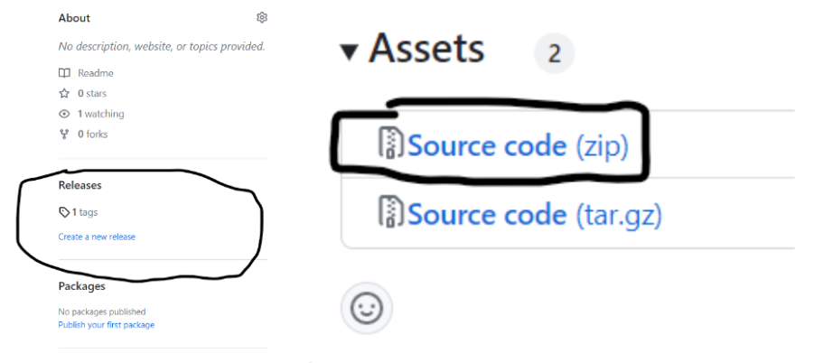

# Army Ranger Personnel Tracker
This project provides a database to hold the information and documents of soldiers in a consolidated and secure fashion. This database can be searched and sorted by multiple criteria pertaining to soldiers, such as rank, company, or name. This function is provided through a secured frontend with login functionality, including account restrictions on what data can be accessed and edited based on the role and rank of the user logged in.

# Install Guide

## Frontend Instructions
### Prerequisites:
You must be able to run npm commands. The website bellow contains instructions for downloading on both windows and mac. You can ignore everything on the website before Prerequisites.
https://radixweb.com/blog/installing-npm-and-nodejs-on-windows-and-mac

### Download App instructions:

1. Click on the tag link in the releases tab, located on the left side of github. Then, click the Final Release Tag and click the Source Code(zip) file. This will download the files.

2. Open a File tab and go to downloads. From there, locate the zip file titled “2308-The-OphiologistsArmyRangerPersonnelTracker-Download.” Right click on the file and select “Extract All.” Make sure to remember where the files are being placed after being extracted. 
3. Press Windows Key + R, then type "cmd," then press enter to open a command prompt.
     - This is intended to open a terminal. If you are facing issues opening a command prompt with the above instructions, you can also click the search option at the   bottom of your screen and type terminal 
4. From the command prompt, navigate to the project folder
     - You can use cd FOLDERNAME to enter a folder and cd .. to go back
     - An unzipped folder creates a folder within a folder, so you will need to enter the base folder and the folder within that to access the project.
5. When you are in the project folder, type “npm install” and press enter. (This may take a few minutes to complete)
6. To start the app, type “npm start” and press enter
7. If you have a pop-up asking to allow access, click the box to allow private networks, but make sure allowing public networks is unchecked. Then click allow.

### Potential Issues:

In the Prerequisite section, the website discusses chocolaty, which is a software needed to download npm. If you don’t know if you have chocolaty, the installer can handle downloading it for you. While following the download instructions, there will be a point where it gives you the option to install chocolaty, so click the box that accepts it when the option appears. 

## MySQL Instructions
### SQL download
1. Navigate to MySQL download (https://dev.mysql.com/downloads/installer/)
2. Download the installer and use it
3. Configure settings appropriately (default is fine) and proceed through installation
4. Set root password for database
5. Update password and socket accordingly in Python code
6. MySQL installation should install “MySQL Workbench” alongside, but if not download that too

### SQL Explanation:

# Release Notes

## Version 0.4.0
### Features:
- Added clearance restrictions depending on ranger rank and admin status

- Added login and logout capabilities

- Added dashboard welcome screen
### Bug Fixes:
- Fixed issue where registering a ranger would register twice

- Fixed status field to store correct ranger activity values
### Known Issues:
N/A

## Version 0.3.0
### Features:
- Added ability to add data to existing tables in database and modifying currently stored data
 
- Implemented method to move pdf files and replace consecutive pdf pages with pages from another file

- Individual personnel pages created for each person in database, including capability to upload pdf under individual selected

### Bug Fixes: 
- Fixed sorted data view to be properly aligned

- Fixed issue where selecting any ranger would send user to individual page of one ranger

- Format checking for various fields of data entry corrected

### Known Issues:
N/A

## Version 0.2.0
### Features:

 - Added multifield sorting and searching to database procedures
 
 - Connected frontend to backend, database queries can be run from UI

 - Created server intermediary between UI and database, restricts database access to provided procedures

### Bug Fixes:

 - Search bar modified to no longer not show results if results are set to be permanently visible

 - Table view modified such that data shown in table is no longer unaligned due to length differences of input strings

 ### Known Issues:
 
 - Server intermediary currently does not allow connections outside of host
 
 - The front end does not properly align sorted data

## Version 0.1.0

### Features:

-   Added tables for holding basic soldier information, relative data, documents, and accounts
    
-   Added sorting and searching functions based on name, id, and company
    
-   Created basic frontend mockup

### Bug Fixes:

N/A

